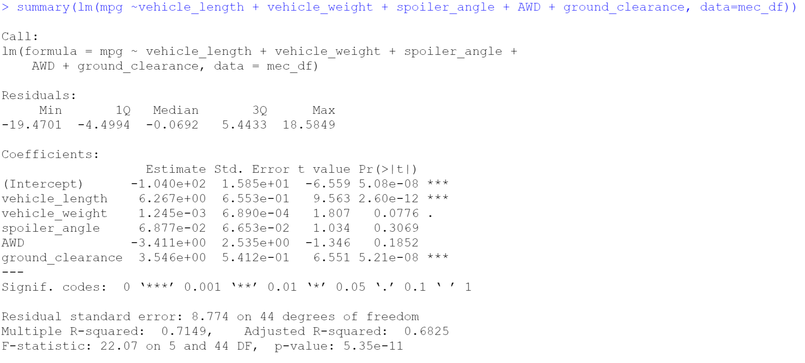
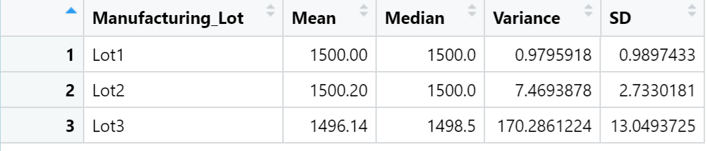

# MechaCar_Statistical_Analysis

## Linear Regression to Predict MPG
According to the analysis, we have the following results:
- Vehicle length and ground clearance provided a non-random amount of variance to the mpg values in the dataset.
  - In order words, the vehicle length and ground clearance have a significant impact on the mpg of MechaCar prototypes.
- The slope of the linear model is not considered to be zero. 
  - As we see the result shows the probability of each variables:
    - The p-value of intercept, vehicle length and ground clearance are much smaller than the significant level 0.05 that we could reject the null hypothesis. In order words, there's sufficient evidence to indicate the slope of the linear model is not considered to be zero. 
- This linear model predicts mpg of MechaCar prototypes effectively.
  - According to the result, the multiple R-squared is 0.7149, which means 71.49% of the variability of our dependent variable is explained using this linear model. In addition, the p-value of our linear regression analysis is 5.35x10^(-11),, which is much smaller than our assumed significance level.

#### Reference:

## Summary Statistics on Suspension Coil
The design specifications for the MechaCar suspension coils dictate that the variance of the suspension coils must not exceed 100 pounds per square inch. 
- According to our total summary result: The current manufacturing data meets this design specification for all manufacturing lots in total. Variance is 62.29 which is smaller than 100 as design. 
- Also, we can see that Lot 1 and Lot 2 have the small variances that meet the design specification in the lot summary; however, the variance of Lot 3 is roughly 170.29 that exceed the suspension coils dictate. Overall, the variance from individual lot is failed to meet the design specifications for MechaCar, when average out for all manufacturing lots in total, it meets the requirement.

#### Reference:

## T-Tests on Suspension Coils
briefly summarize your interpretation and findings for the t-test results. Include screenshots of the t-test to support your summary.

## Study Design: MechaCar vs Competition
Write a short description of a statistical study that can quantify how the MechaCar performs against the competition. In your study design, think critically about what metrics would be of interest to a consumer: for a few examples, cost, city or highway fuel efficiency, horse power, maintenance cost, or safety rating.

In your description, address the following questions:
What metric or metrics are you going to test?
What is the null hypothesis or alternative hypothesis?
What statistical test would you use to test the hypothesis? And why?
What data is needed to run the statistical test?
