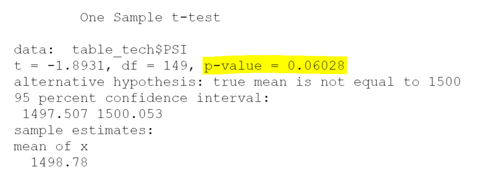
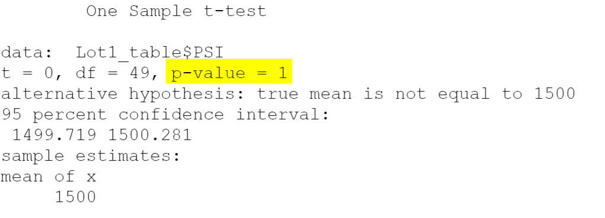
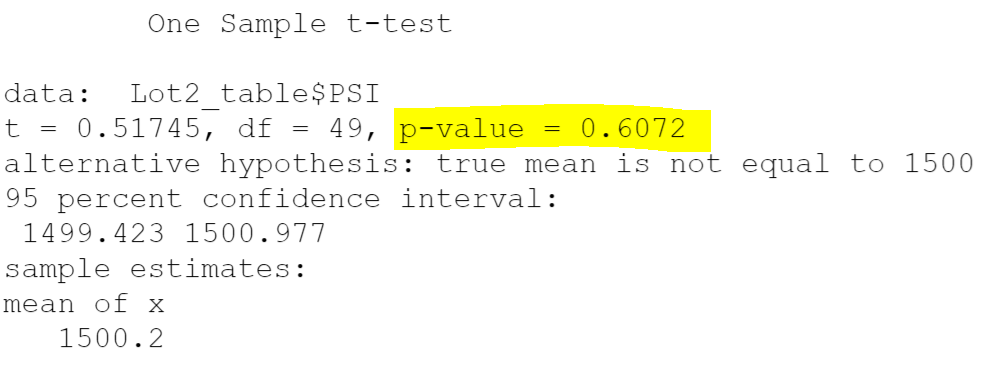
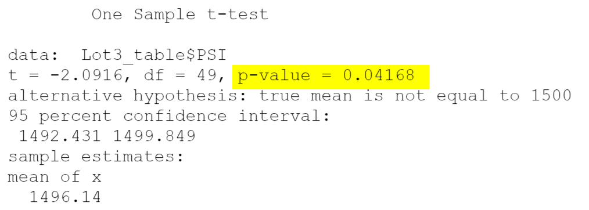

# MechaCar_Statistical_Analysis

## Linear Regression to Predict MPG
According to the analysis, we have the following results:
- Vehicle length and ground clearance provided a non-random amount of variance to the mpg values in the dataset.
  - In order words, the vehicle length and ground clearance have a significant impact on the mpg of MechaCar prototypes.
- The slope of the linear model is not considered to be zero. 
  - As we see the result shows the probability of each variables:
    - The p-value of intercept, vehicle length and ground clearance are much smaller than the significant level 0.05 that we could reject the null hypothesis. In order words, there's sufficient evidence to indicate the slope of the linear model is not considered to be zero. 
- This linear model predicts mpg of MechaCar prototypes effectively.
  - According to the result, the multiple R-squared is 0.7149, which means 71.49% of the variability of our dependent variable is explained using this linear model. In addition, the p-value of our linear regression analysis is 5.35x10^(-11),, which is much smaller than our assumed significance level.

#### Reference:

## Summary Statistics on Suspension Coil
The design specifications for the MechaCar suspension coils dictate that the variance of the suspension coils must not exceed 100 pounds per square inch. 
- According to our total summary result: The current manufacturing data meets this design specification for all manufacturing lots in total. Variance is 62.29 which is smaller than 100 as design. 
- Also, we can see that Lot 1 and Lot 2 have the small variances that meet the design specification in the lot summary; however, the variance of Lot 3 is roughly 170.29 that exceed the suspension coils dictate. Overall, the variance from individual lot is failed to meet the design specifications for MechaCar, when average out for all manufacturing lots in total, it meets the requirement.

#### Reference:

## T-Tests on Suspension Coils
### Overall Manufacturing Lots
According to the result, our p-value is slightly above the significance level was the common 0.05%. Therefore, we fail to reject the null hypotheses. In order words, the PSI across all manufacturing lots is not statistically different from the population mean of 1,500 pounds per square ich.

### Individual Manufacturing Lots
- Lot 1 Result:
Based on the result, the Lot_1 p-value is equal to 1, which is much larger than significant level that we do not have sufficient evidence to reject the null hypothesis. In order words, the PSI across manufacturing Lot_1 is not statistically different from the population mean of 1,500 pounds per square inch. Also, we could state that we're making the Type I error for sure when the null hypothesis is true.

- Lot 2 Result:
Based on the result, the Lot_2 p-value is also much larger than significant level that we do not have sufficient evidence to reject the null hypothesis. In order words, the PSI across manufacturing Lot_2 is not statistically different from the population mean of 1,500 pounds per square inch. 

- Lot 3 Result:
Based on the result, the Lot_3 p-value is smaller than significant level that we do have sufficient evidence to reject the null hypothesis. In order words, the PSI across manufacturing Lot_3 is statistically different from the population mean of 1,500 pounds per square inch.

 

## Study Design: MechaCar vs Competition
### Overview of Statistical Study
MechaCar is suffering from production troubles that blocking the manufacturing progress. In our statistical studies, we will compare vehicle performance of the MechaCar vehicles againest vehicles from other manufacturers. Our goal is to find out vehicles from the MechaCar performs against the competition. 
### Outline for Study Design
1. Data: We perform analysis by using the vehicles dataset from MechaCar and three other manufacturers.
2. Metrics:
  - Dependent Variable:
    - Maintenance Cost
  - Independent Variables:
    - Highway Fuel Efficiency
    - Miles-per-gallon(MPG)
    - Safety Rating
    - Horse Power
3. Hypothesis:
 -  Null Hypotheis: There is no statistical difference between MecheCar's vehicles and other three manufacturers based on all factors.
 -  Alternative Hypothesis: There is statistical difference between MecheCar's vehicles and other three manufacturers based on all factors.
4. T-test and Multiple Linear Regression: use multiple independent variables to account for parts of the total variance observed in dependent variable. According to the factors, we could compare the performance of the vehicles of MechaCar and other manufacturers.

